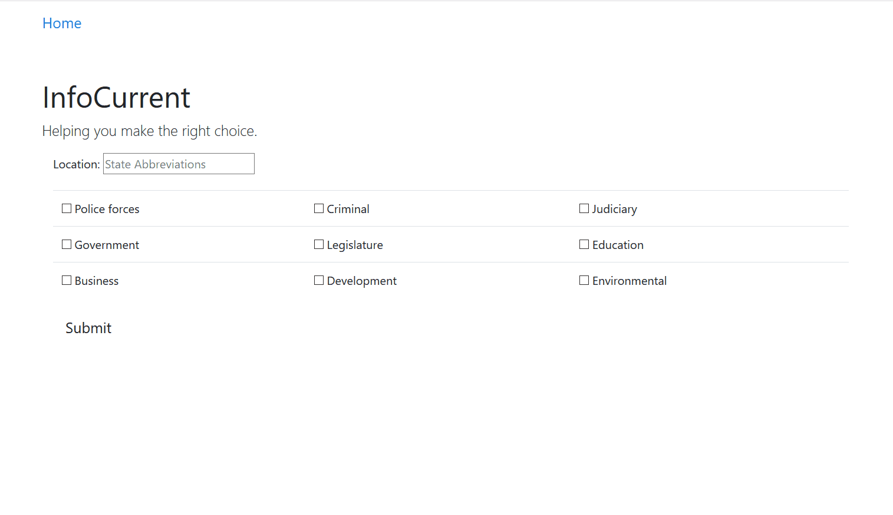

# InfoCurrent

Helping home buyers know the factors that are making an impact on a state.

## Business Use Case

A home buyer weighs multiple factors in the process of buying a home. Firstly,
the location of the property is important. (For the purposes of this project,
a location refers to a State of )On top of the location, knowing the
general stability of a location, and the people and groups that support or
challenge that stability, is also valuable.

---

## Solution

Link: [infocurrent.xyz](infocurrent.xyz)

The solution for the business problem can be solved by compiling and looking
at the news stories from a certain location. In general, this can in general
give the answer that the user is looking for.

InfoCurrent filters through events logged in the GDELT database to produce
results for the user. InfoCurrent in particular only considers events in US
States. The data in GDELT does hold some sparse data, and part of the process
within InfoCurrent, is to filter out sparse data and extract the useful data.
Events consist of many different points of information, and one that's
crucial for this application is the 'Goldstein Scale' of an event. The scale
falls between -10.0 to 10.0, severely negative impact by extreme conflict to
post impact by extreme cooperation. This rating itself is determined by the
type of event it is addressing.

The events for the US states are consolidated and grouped by year. The number
of events happening in a state are tracked, and the goldstein ratings are
continously summed. Using the sum of the goldstein ratings and the number of
events from a location, the average of the goldstein rating can be quickly
derived. Note that, the average goldstein rating also serves as the final
"Impact score" that the user sees. Also note that the rating is normalized
to a value between 0.0-1.0 before the final step.

### Global Database of Event, Language and Tone (GDELT)

The GDELT project collects news stories from print and web sources from around
the world. It's able to identify a number of people, organizations, themes,
emotions, and ultimately events that are driving the global soceity. This live
data mining projects produces one of the largest open spatiotemporal datasets
that exist.

---

## ETL Pipeline

New GDELT updates are acquired from the source. A Python script processes the
data and places it in a PostgreSQL database. Since GDELT updates are posted
every 15 minutes, an Airflow workflow is scheduled to complete this process as
new data arrives.

GDELT's historic data exists in an Amazon S3 bucket. An offline batch
processing Apache Spark job reads and processes the data from S3. The
processed data is saved in a PostgreSQL database. The user facing component of
this pipeline is the Flask application. The user is able to specify a single
state, and a set of actors they are interested in. The application makes the
appropriate queries to the PostgreSQL database. The results are viewed on the
Flask application.

---

## User Interface

Link to Flask application: [infocurrent.xyz](infocurrent.xyz)

---

## Installation

Things are need to be installed and running

- Apache Spark
- PostgreSQL Database
- Flask
- Airflow
- Python
- sqlalchemy
- pandas
- psycopg2
- pandasql

---

## Presentation link

Link to [Infocurrent presentation](https://drive.google.com/open?id=1sJA4uKb4dhWmTK1ziCTA7QJD9o_QrzQP3eAYYRANOlM)